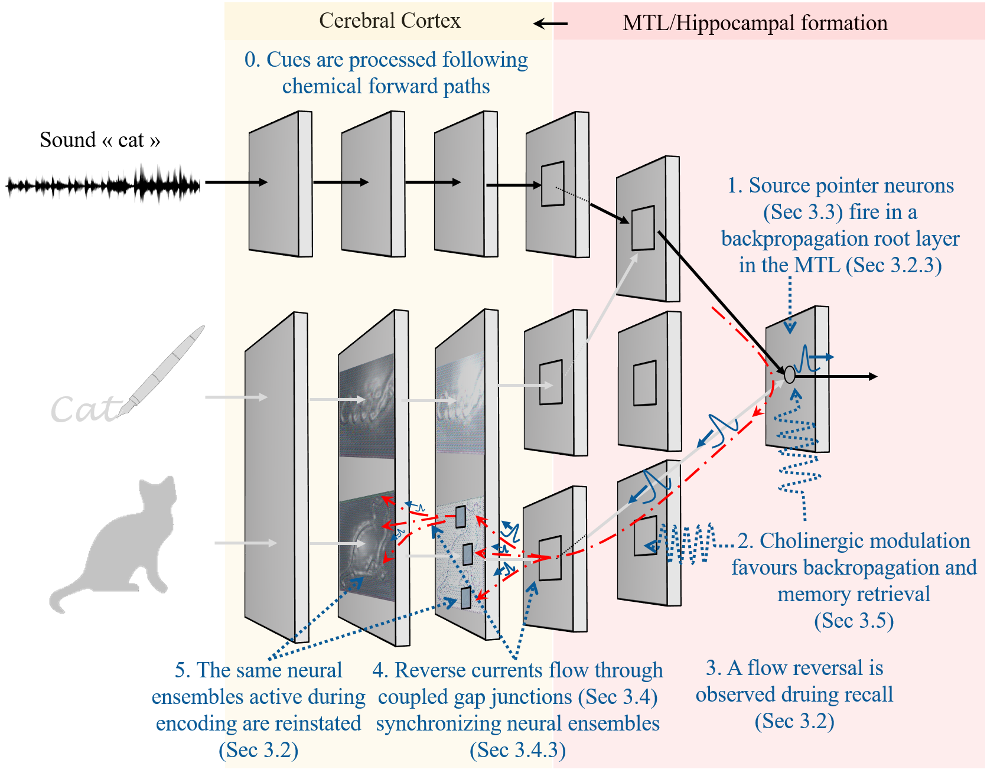
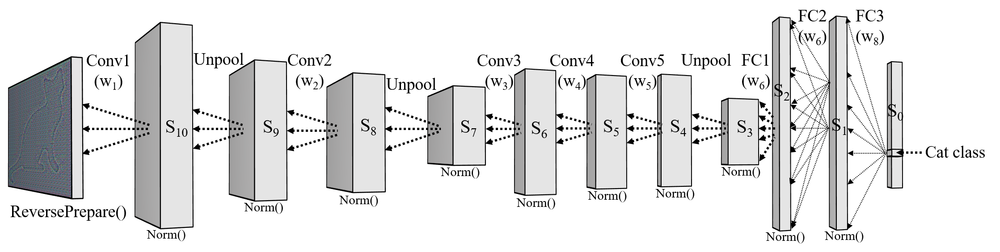
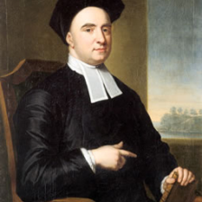

<h1 align="center">Backpropagation-based recollection of memories</h1>

<i>If there is such a simple mechanism to solve the problem, why wouldn't nature use it?</i>

https://github.com/user-attachments/assets/a6159115-f002-456b-a425-2695d42a47f0

This repository hosts the code and data supporting my research on what I called the backpropagation-based recollection hypothesis. 

## Research Papers

The work is documented in the following papers:

- **Early Version:** Zied Ben Houidi, “The backpropagation-based recollection hypothesis: Backpropagated action potentials mediate recall, imagination, language understanding, and naming.” Jan'21. arXiv preprint [arXiv:2101.04137](https://arxiv.org/pdf/2101.04137.pdf).

- **Major Update:** Zied Ben Houidi “Backpropagation-based Recollection of Memories: Biological Plausibility and Computational Efficiency.” bioRxiv 2024.02.05.578854. Feb'24. doi:[10.1101/2024.02.05.578854](https://doi.org/10.1101/2024.02.05.578854).

## Repository Structure

### Code to reproduce results

- **First Version: Object Naming** 
Under - `naming/` :
  - `find_params/`: Code for experimenting with Spiking Neural Network (SNN) parameters.
  - `novelty_modulated_oneshot/`: Implements one-shot learning experiments based on the hypothesis.
  - `svm_one_shot/`: Baseline one-shot experiments using SVM.
    - Based on Perez's SNN implementation: [SDNN_python](https://github.com/npvoid/SDNN_python)

- **Major Update: Image Reconstruction**
  - `reconstruct/`: Contains (I hope easy to follow) notebooks for image reconstruction experiments.
  - Trained Models can be found [here](https://drive.google.com/drive/folders/1qH_wSRvIw_9hZwq77O8_eJUcXUUgqk7g?usp=sharing)

## Backpropagation-based Recollection of Memories: Overview

## What mechanism allows to recall the details of a memory trace?

Try to mentally picture the image of a cat. In this process, the word "cat" acted as a cue, and the fragile and non-persistent retrieved mental image is a *recollected memory*. Similar cue-based generative activities are ubiquitous in our lives, yet the underlying neural mechanisms are still a mystery. Neuroimaging and optogenetic-based studies suggest that cue-based recollection of memories involve the reactivation of the same neural ensembles which were active during perception (encoding). However, the exact neural mechanisms that mediate such reactivation remain unknown. *To date, no biologically plausible computational model succeeded to simulate a simple image reconstruction task, a target that we achieve in this work.*

### 1. Memory Retrieval via Exact Neural Pathway Reversal

We elaborate a simple biologically-plausible candidate mechanism explaining how such reinstatement could be implemented at the level of single neurons: *We propose that the very same neural pathways and neurons engaged during feed-forward perception are retraced in reverse during recall, thus recreating similar subjective experiences during memory retrieval.* Neural reinstatement is here the process where, starting from few sparse neurons such as concept cells (invoked thanks to a relevant internal or external cue), the entire details of a trace, stored in the cortex, are reactivated again. Similar to the trail left by Hansel and Grittel to retrieve their path back, the forward pathways leave traces in the forms of synaptic coupling between cells, which are used, by backpropagated currents, to retrieve their way back to all the neurons encoding the memory trace details. Anecdotally, the fact that such backward signals are transient and fading away in nature could explain the subjective non-persistent aspect of recalled memories and mental images.

*In advancing this theory, we are aware of its unorthodox nature and the paradigm shift it proposes*—challenging the conventional feed-forward neural computation with a model of backpropagative memory recollection. *We anticipate skepticism about biological plausibility* but we believe that our compelling computational evidence and thorough review of biological precedents, make a solid case for this novel framework. *Beyond a mere theoretical proposition, this work is a call for a fundamental reevaluation of neural mechanisms through a fresh and critical lens*.

### 2. Overlooked Evidence for Biological Plausibility

Our literature review uncovers a range of findings that, while not yet mainstream, strongly support the biological plausibility of our hypothesis, highlighting under-explored areas within the field. For example, we found that action potentials do backpropagate and that such backpropagation can be modulated by the same cholinergic systems that trigger encoding and retrieval of cue-based memories. Similarly, bi-directional gap junctions, which are able to carry our backpropagated reconstruction currents, are not confined to developmental stages or the olfactory bulb, as is often suggested. Instead, recent evidence indicates their widespread presence in the cortex, suggesting a disparity between their prevalence and the limited functions currently understood. Blocking gap junctions actually even disrupts memory and related network oscillations, but the "how" is poorly understood.

1. **Forward Processing of Cues via Chemical Synapses**

   Established neural pathways convey sensory information to the MTL for memory processing (Mishkin et al., 1983; Squire & Zola-Morgan, 1991).

2. **Activation of Source Pointer Neurons in the MTL**

   Highly selective neurons in the MTL/hippocampus ("pointer neurons") fire in response to specific cues, indexing the corresponding memory trace. Neurons selectively responding to specific concepts have been identified in the MTL (Quiroga et al., 2005, 2008). The hippocampus serves as an indexing system for memory retrieval (Teyler & DiScenna, 1986; Moscovitch, 2008).

3. **Cholinergic Modulation Facilitates Backpropagation and Memory Retrieval**

   Cholinergic modulation enhances backpropagation in hippocampal neurons (Tsubokawa & Ross, 1997; Hoffman & Johnston, 1999). Phasic cholinergic release plays a crucial role in memory encoding and retrieval (Leaderbrand et al., 2016; Sun et al., 2021). Cholinergic signaling modulates memory-related neural oscillations (Fisahn et al., 1998; Betterton et al., 2017).

4. **Flow Reversal Observed During Recall**

   Top-down reactivation patterns are observed during memory recall (Staresina et al., 2013; Dijkstra et al., 2017). Neural reinstatement supports the encoding specificity principle (Frankland et al., 2019).

5. **Reverse Currents Flow Through Coupled Gap Junctions, Synchronizing Neural Ensembles**

   Gap junctions are much more prevalent in the adult brain than previously thought, particularly in the hippocampus and cerebral cortex (Nagy et al., 2018; Pereda, 2014). They contribute to network oscillations associated with memory processes (Buzsáki & Kandel, 1998; Posłuszny, 2014). Disruption of gap junctions impairs memory retrieval (Frisch et al., 2005) and memory-related oscillations (Buhl et al., 2003; Hormuzdi et al., 2001).

6. **Reinstatement of Neural Ensembles Active During Encoding**

   Neural reinstatement during recall has been demonstrated using optogenetics and neuroimaging (Liu et al., 2012; Tanaka et al., 2014; Dijkstra et al., 2017). Memory retrieval involves reactivation of encoding-specific neural patterns (Frankland et al., 2019).

7. **Gap Junctions Adapt to Chemical Synaptic Plasticity**

   Gap junctions coexist with and adapt to changes in chemical synapses (Nagy et al., 2018; Pereda, 2014). Chemical activity modulates electrical coupling strength (Haas et al., 2016), potentially allowing backpropagated currents to follow paths strengthened during encoding (Alcamí & Pereda, 2019).

### 3. Intriguing computational efficiency

Our computational modelling work further shows that our mechanism is incredibly effective in two different recollection tasks: (i) recalling object names with accuracy comparable to machine learning classifiers and (ii) reconstructing images from sparse activations. To the best of our knowledge, no biologically plausible model has made it to implement such a generative task.

#### Example comparison of original and reconstructed images

  
  

### 4. Impact on cognitive functions and Neuroscience

Finally, this paradigm shift, if validated, would revolutionize our understanding of a broad spectrum of cognitive functions. *Similar cue-based processing is indeed ubiquitous in our life*: we use it for (i) modality-specific language understanding, e.g. when going from words to their signified visual or other underlying representations. We use it also (ii) when naming familiar objects, or (iii) during cue-based attention, e.g. when we focus only on one part of the visual field, inhibiting the rest, in addition to (iv) mind wandering, imagination and future episodic thinking.

*Our proposal further provides a compelling synthesis connecting dots between disparate empirical findings in neuroscience*: First, the role of Acetylcholine in (i) encoding and retrieval of memories, its role in (ii) triggering transient oscillations related to memory, and its less known role in (iii) modulating backpropagated action potentials, which are the hypothesized trigger of our mechanism. Second, our mechanism explains the crucial role of the unexplainably-prevalent gap junctions in (i) memory and (ii) related network oscillations. Finally, our theory provides a concrete link between sparse concept cells and the retrieval of memory traces encoded in distributed cortical areas, effectively bridging the gap between sparse coding and distributed representations in cognitive science: Our proposed mechanism provides an implementation that unifies both: sparse neurons are the pointers or roots from which ACh-modulated backpropagated retrieval of the distributed representations is initiated (roughly speaking, from sparse concept cells that selectively respond to a particular concept, e.g. a cat, back to all the sensory features that relate to it).
